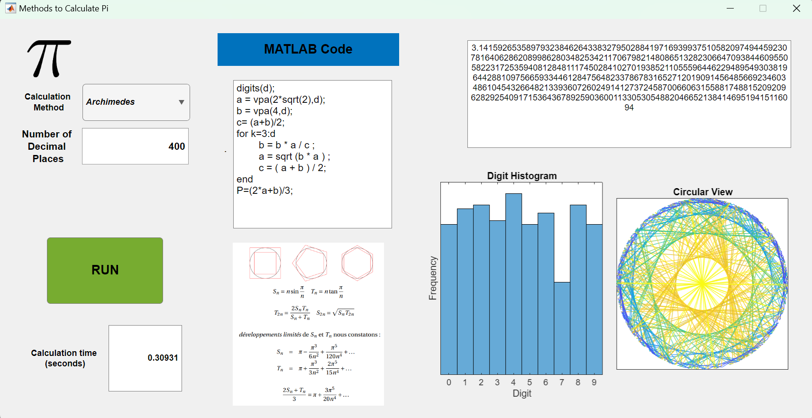
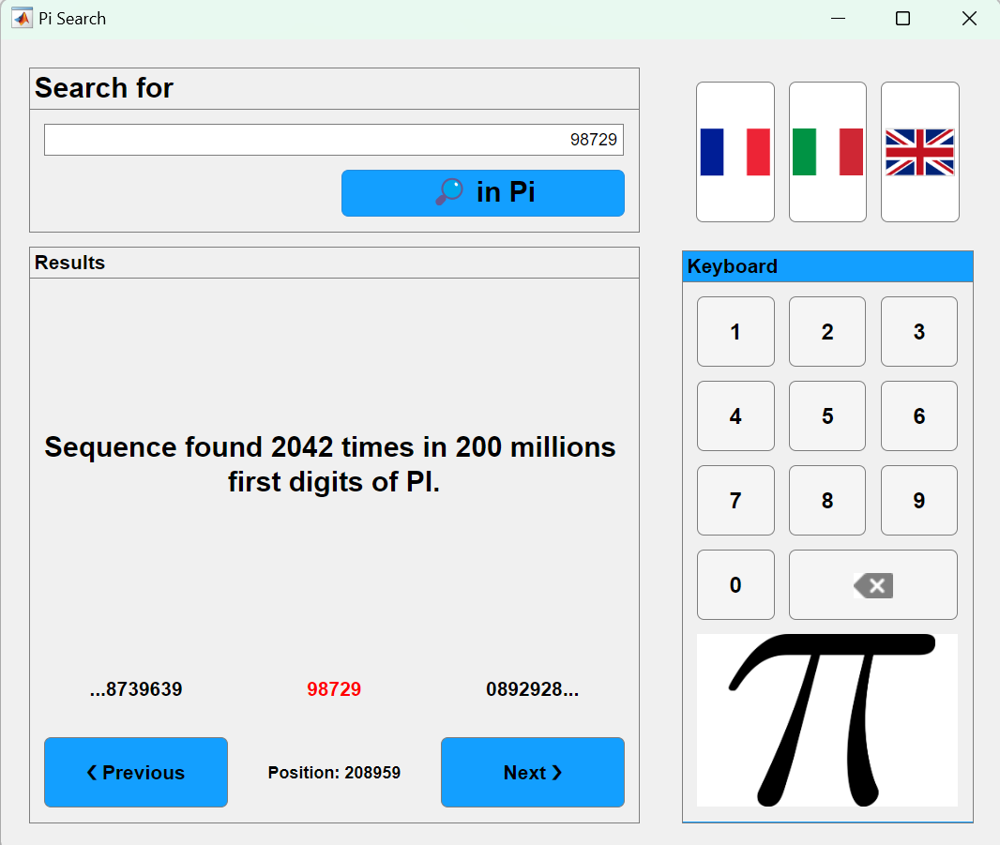

# Pi Apps
# Information

This module contains interactive [MATLAB® Apps](https://www.mathworks.com/help/matlab/app-designer.html) that help you learn more about the mathematical constant pi ( $\pi$ )!

## Background

The number pi has been studied for a very long time, yet it still holds some mysteries... For example, while mathematicians believe it is a universal number, they are quite incapable of proving it! Indeed, it is thought to contain any sequence of digits within its decimals: you would just need to go far enough to find it! Without proof of this astonishing result, they can only verify this hypothesis on the 100 trillion decimals calculated in June 2022...

Before being made available online, this interactive experiment was presented in the Pi Room of Palais de la Découverte in Paris, France. It was created using MATLAB, based on the data from the first 200 million decimals. It allows you to search for any sequence of digits and tells you how many times and where it has been found.

Extensive computer verifications show that all 7\-digit sequences appear at least once in the first 200 million decimals of pi. So your birth date is in there (in fact, on average, about 200 times). However, to find your phone number (10 digits) for sure, you would need to go up to 250 billion decimals...

## Contact Us

Contact the [MathWorks STEM Outreach team](mailto:stemoutreach@groups.mathworks.com) if you would like to provide feedback, or if you have a question.

## Getting Started
### Accessing the Module
### **On MATLAB Online:**

Use the  link to download the module. You will be prompted to log in or create a MathWorks account and the project will then load.

### **On Desktop:**

Download or clone this repository. Open MATLAB, navigate to the folder containing these scripts and double\-click on [pi\-apps.prj](matlab: openProject("pi-apps.prj")). It will add the appropriate files to your MATLAB path and open the app. 

# Apps
### Methods to Calculate Pi

### Pi Search

## Products

MATLAB®, [App Designer](https://www.mathworks.com/help/matlab/app-designer.html)

# License

The license for this module is available in the [LICENSE.md](https://github.com/MathWorks-Teaching-Resources/REPO_NAME/blob/release/LICENSE.md).

# Educator Resources
-  [Educator Page](https://www.mathworks.com/academia/educators.html) 

# Contribute 

Looking for more? Find an issue? Have a suggestion? Please contact the the [MathWorks STEM Outreach team](mailto:stemoutreach@groups.mathworks.com).

 *©* Copyright 2024 The MathWorks™, Inc

